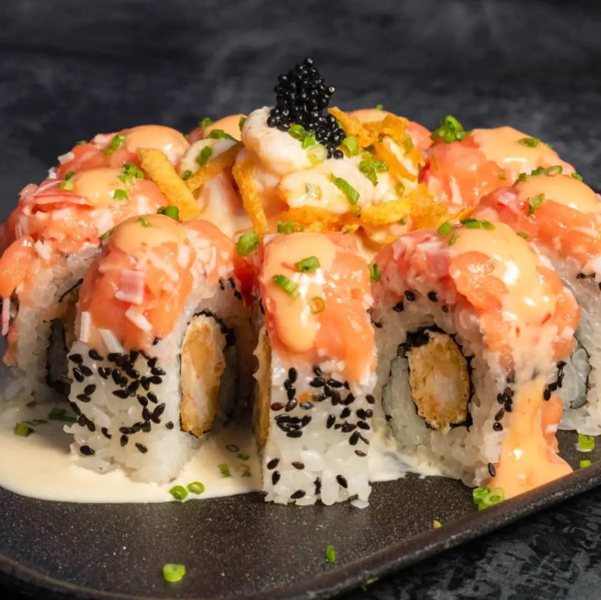
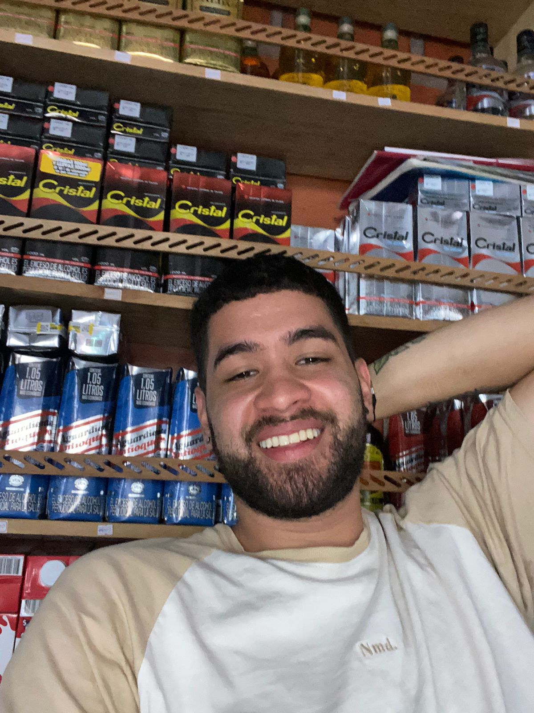

# Programación para videojuegos - 4 dragones esmeralda
<h1>Proyecto colaborativo - Etapa 1</h1>

## Steicy Avilez

- **Rol:** Artista
- **Ubicación:** Tierralta, Córdoba
- **Perfil:** Soy una estudiante de Ingeniería multimedia, tengo 20 años y me gusta mucho dibujar, por eso me apasiona aprender cosas nuevas como la animación 2D y 3D
- **Mi plato favorito:** Espagueti con patacones  

## Nikol Ramirez

- **Nombre:** Nikol Camila Ramirez Murillo
- **Rol:** Diseñadora de Niveles (Level Designer)
- **Ubicación:** Cali, Colombia
- **Perfil:** Hola! Soy Tecnóloga en Animación 3D y estudiante de Ingeniería Multimedia. Tengo 21 años y me apasiona el modelado 3D y la creación de entornos visuales que transmitan emociones.
- **Mi plato favorito:**  

## Andrés Salazar

- **Rol:** Programador principal
- **Ubicación:** Riosucio, Caldas, Colombia
- **Perfil:** Soy estudiante de ingeniería multimedia y tengo 22 años. Me interesa mucho la programación y la animación.
- **Mi plato favorito:** Bandeja paisa  

## Yilmar Salazar

- **Rol:** Game designer
- **Ubicación:** Istmina, Chocó
- **Perfil:** Soy estudiante apasionado por la multimedia, con interés en la creación de proyectos interactivos, producción audiovisual y el uso de la tecnología para la innovación.
